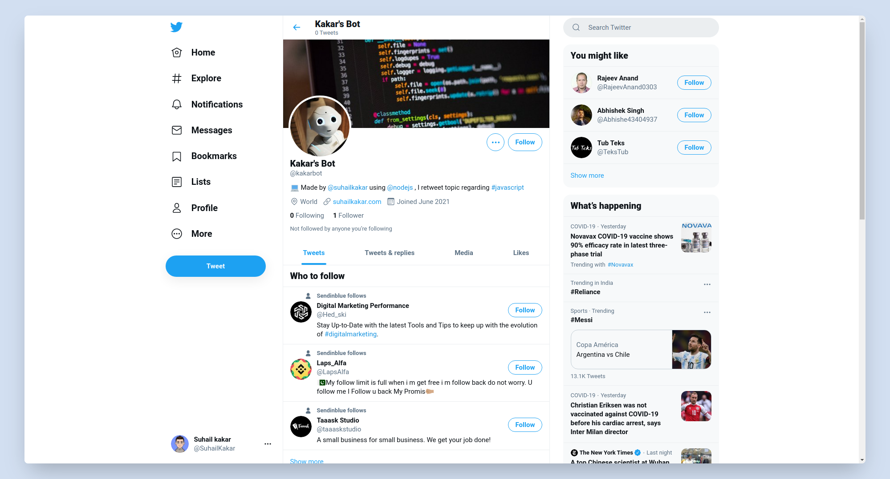

<p align="center">
    
</p>
   
**Twitter** is an American microblogging and social networking service on which users post and interact with messages known as "tweets". Registered users can post, like, and retweet tweets, but unregistered users can only read them.

A Twitter bot is a type of bot software that controls a Twitter account via the Twitter API. The bot software may autonomously perform actions such as tweeting, re-tweeting, liking, following, unfollowing, or direct messaging other accounts.

 

### Built With

- [Node JS](https://nodejs.org/en)

### Deployed In

- [Heroku](https://www.heroku.com)

### Folder Structure

```
📦  Twitter-Bot-main
├─ images
│  ├─ image.png
│  └─ logo.png
├─ src
│  ├─ config.js
│  └─ index.js
├─ .gitignore
├─ LICENSE
├─ README.md
└─ package.json
```

### Installation

1. Clone the repo
   ```sh
   git clone https://github.com/suhailkakar/Twitter-Bot/
   ```
2. Install NPM packages

   ```sh
   npm install
   ```

   or

   ```sh
   yarn install
   ```

3. Run the app
   ```sh
   node src/index.js
   ```

### Contributing

Contributions are what make the open source community such an amazing place to be learn, inspire, and create. Any contributions you make are **greatly appreciated**.

1. Fork the Project
2. Commit your Changes (`git commit -m 'Some Good Features'`)
3. Push to the Code (`git push -u origin master `)
4. Open a Pull Request

## License

Kakar's Bot is open source software licensed under the MIT License

### Contributor

- [Suhail Kakar](https://suhailkakar.com)
